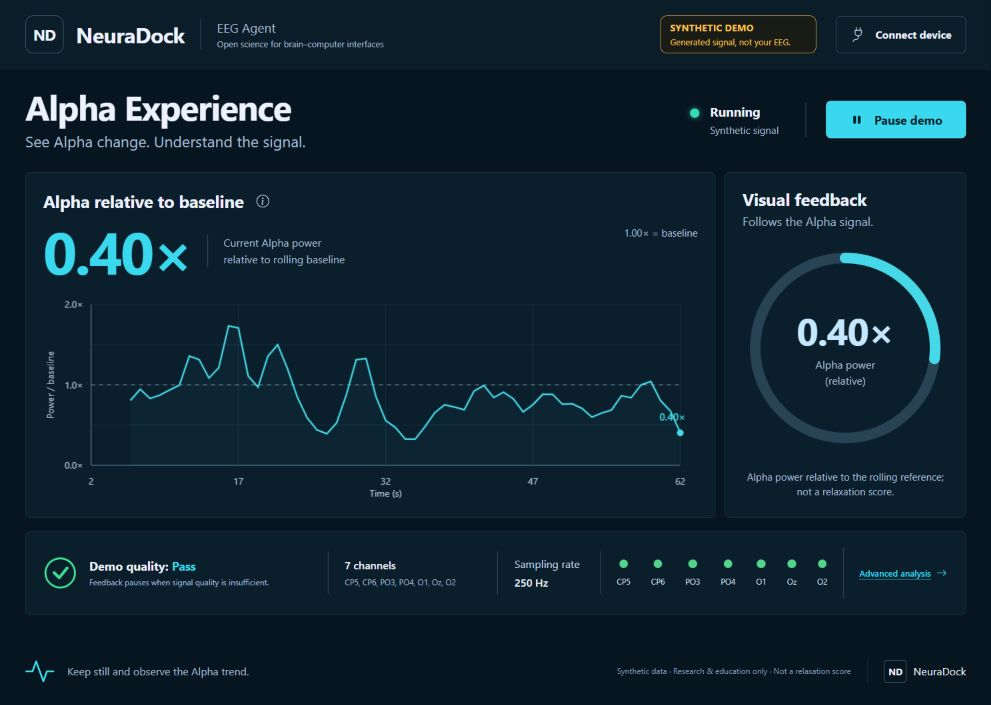

# Alpha Experience — design QA
Date: 2026-09-22

Final result: passed within the local software-only scope below.

## Visual evidence

The selected design direction is **Signal Observatory**: dark navy surfaces,
cyan Alpha feedback, a large feature history, and a visible seven-channel
quality strip. This image is an actual application capture using generated
software-test signals, not participant EEG. Values were not forced to match
the illustrative design concept.

The screenshot contains the browser's native 991 × 705 content area, cropped
from a capture with blank padding; no UI was retouched or redrawn. Detailed
comparison captures remain local QA artifacts and are not required to run
the application.

## Layout and accessibility checks

- Desktop (1487 × 1058), short desktop (1264 × 712), tablet (820 × 1180),
  and phone (390 × 844) layouts inspected, with no horizontal overflow.
- The seven-channel quality strip remains within the short desktop viewport.
- Canvas sizing no longer expands the tablet/mobile page through intrinsic
  layout feedback. Text and primary controls remain visible.
- Visible keyboard focus, descriptive control labels, non-color warning text,
  reduced-motion rules, and keyboard dialog exit checked.
- Official Bootstrap Icons 1.11.3 are bundled with their MIT license;
  there is no runtime icon CDN dependency.

## Browser interactions verified

- Synthetic source label, baseline warmup, quality-pass state, and matching
  chart/readout/ring values.
- Pause retains historical plots, hides current feedback, and continues
  checking source and quality. Resume restores display updates.
- The Alpha explanation describes the rolling baseline and interpretation
  limits without claiming a relaxation or mental-state score.
- Connect device opens setup instructions and generates a terminal command;
  Copy works. It does not itself connect to hardware or execute the command.
- Escape closes the dialog and restores focus to the triggering control.
- Advanced analysis opens the retained research view; Back restores polling.
- Stopping the local server produces Connection lost / Quality unavailable,
  hides both current values, and marks channel state unavailable. Restarting
  restores operation.
- No unexpected JavaScript errors or warnings in the final normal run.

Automated state and HTTP checks cover additional failure cases; see
[TESTING.md](TESTING.md) for commands and coverage.

## Limitations

- No physical EEG device, human recording, clinical benefit, or end-to-end
  hardware latency was verified. Validation used synthetic replay and bounded
  loopback transport tests.
- The baseline is a rolling reference, not fixed calibration.
- A full screen-reader or WCAG audit was not performed.
- The connection dialog is a setup/command-generation flow, not a new
  browser-to-device connection API.
